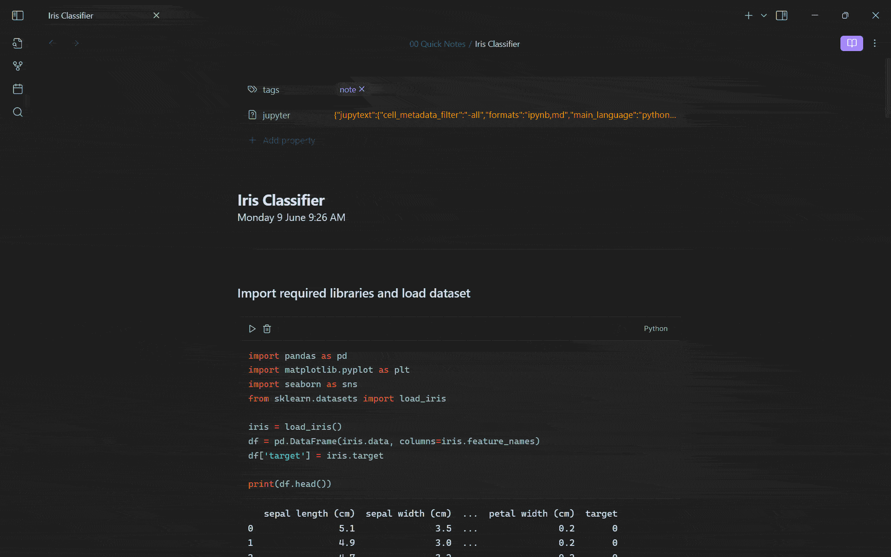
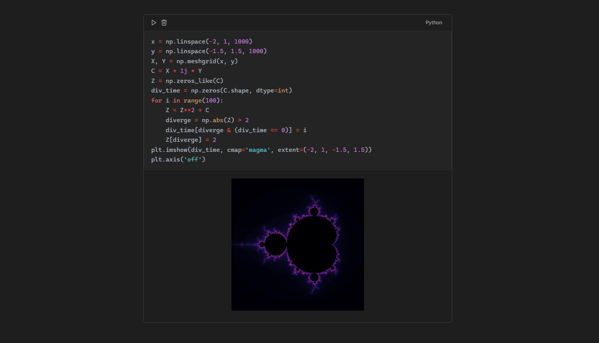

# JupyMD for Obsidian

Enables Jupyter notebook functionality in Obsidian. Make markdown files behave like `.ipynb` notebooks, with live code execution, rich output rendering, and bidirectional syncing between `.md` and `.ipynb` files.

## Integrate your programming notes into Obsidian

With JupyMD you can:
- Run Python code
- Create plots with `matplotlib`
- Conduct data analysis with `pandas` dataframes
- Build machine learning models with `sklearn` and `pytorch`
- And much more

... all in your Obsidian vault!

## Use-cases:

### Machine learning workflow

### Visualising fractals with `matplotlib`

## Features

- **Notebook Conversion** – Convert existing notes in Obsidian to `.ipynb` files via Jupytext
- **Bidirectional Updates** – Changes in Obsidian or Jupyter automatically sync between `.md` and `.ipynb` files
- **Execute Code** – Run code blocks in Obsidian with output captured below each block
- **True Jupyter Sync** – Executed code blocks automatically update output metadata in linked `.ipynb` file
- **Persistent Outputs** – Executed code outputs stay visible after restart and sync to `.ipynb` file
- **Rich Output** – Support for `matplotlib` plots and `pandas` dataframe outputs

## Prerequisites

- [Python](https://www.python.org/downloads/)
- [Jupyter Notebook](https://jupyter.org/install)
  `pip install notebook`
- [Jupytext](https://github.com/mwouts/jupytext)
  `pip install jupytext`

## Getting started

Simply execute the following command on a note you want Jupyter notebook capability on:
> `JupyMD: Create Jupyter notebook from note`

This will create an `.ipynb` file with the same file name as the current note on the file directory, and will transform your Python code blocks into interactive code blocks. Your note will now behave like a Jupyter notebook, and sync its contents automatically to the `.ipynb` file. You may choose to ignore the created `.ipynb` file completely, as its functionality will be mirrored in Obsidian.

> [!NOTE]
> JupyMD currently supports Python execution only.
>
> Future versions will expand language support, though this feature is not yet in active development. Your help is appreciated, feel free to open an issue or submit a pull request if you would like to contribute!

JupyMD is an independent project and not affiliated with Project Jupyter or Obsidian.
